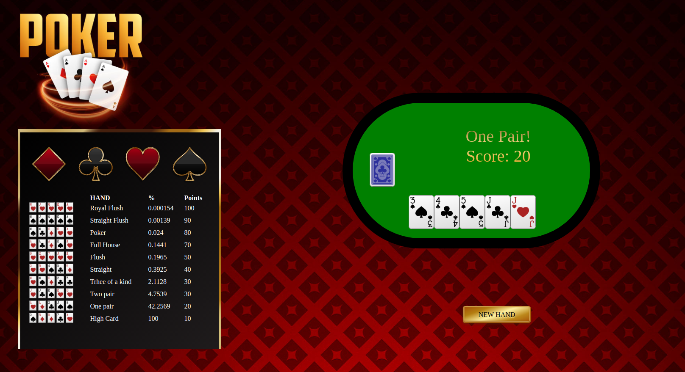

# Poker Hand Calculator

This project shows a randomly generated hand calculator from a deck of cards.
Internally, you are ready to deploy new players and compare your scores to determine the winner in each hand. Also, a table of possible winning hands is attached along with the score they provide and the probability that this hand will be generated.

<br/>

<hr>

## Scripts

```
$ npm run start
```

Start webpack-server to develop project on development mode.

```
$ npm run build
```

Build the project on production mode

```
$ npm run watch
```

```
$ npm run test
```

<hr>

## Webpack configuration

### Devtools

[webpack-dev-server](https://webpack.js.org/configuration/dev-server)

### Plugins

[clean-webpack-plugin](https://github.com/johnagan/clean-webpack-plugin)

[html-webpack-plugin](https://webpack.js.org/plugins/html-webpack-plugin)

### Loaders

[css-loader](https://github.com/webpack-contrib/css-loader)
<br>

[style-loader](https://github.com/webpack-contrib/style-loader)
<br>

[file-loader](https://github.com/webpack-contrib/file-loader)
<br>

[csv-loader](https://www.npmjs.com/package/csv-loader)
<br>

[xml-loader](https://www.npmjs.com/package/xml-loader)
